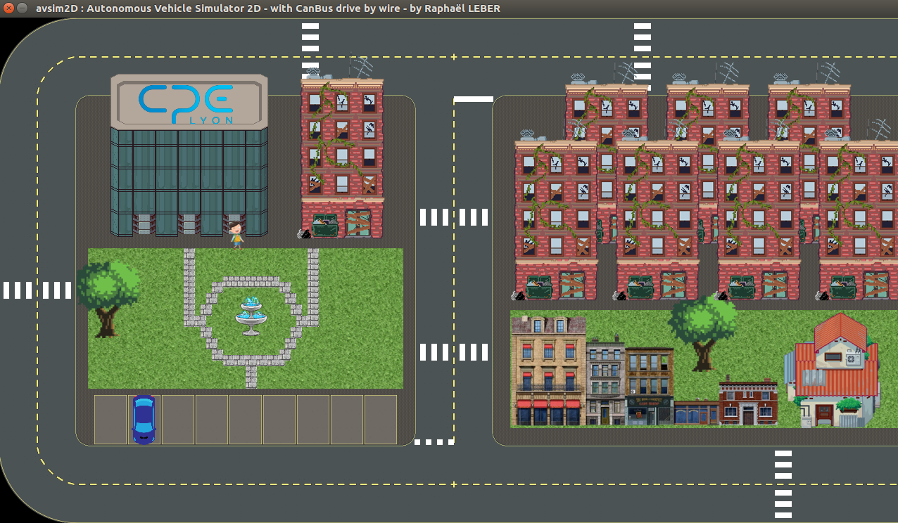

# Autonomous Vehicule - CAN Bus - Practical work 
(Module Autonomie et systèmes des transports)

## Goal

The goal of this series of practical work is to graze a few concepts about autonomous vehicule and CAN bus


## Project limits and weaknesses
- The vehicule architecture is very simplified
- X-by-Wire is supposed to be done with a FlexRay bus, but it's easier to implement it in CAN for such student project
- You will not follow the automotive specifications and norms (except a few ones). It would take too much time
- This 'covid' edition of this course prevents us to material with real ECU and CAN-bus... therefore we can't experiment CAN errors and we can hardly be misra compliant.


## Deliverable
- Keep track of your work in a report. The icon :pencil: will remind you to do so along the following sections. Keep as much relevant screen captures as you can, and place them in your report. The report will be a README.md file written in [Markdown](https://about.gitlab.com/handbook/engineering/ux/technical-writing/markdown-guide/).  
- Provide **commented** code of your work
- A gitlab repository will be created for you. Please place your code and your report in it. 
- At the end of each practical work, you should [**TAG**](https://docs.gitlab.com/ee/university/training/topics/tags.html) your last commit (tag "TP1" "TP2b" "TP2b" "TP3")


## Set up
<!-- Setup for CPE workstation -->
Setup for your workstation

### Install simulator
This is the simulator you will use:

To make it work. Follow those steps:

#### ONLY on a CPE workstation 

- Add python 3.6 to your path. In ```~/.bashrc``` add 
```bash
export PATH=$PATH:"/softwares/INFO/Robotiques/python/python3.6/bin"
alias python3='python3.6'
```

- Close the terminal and open a new one. Check python is 3.6 with 
```bash 
python3 --version
```

- Create a virtualenv:
```bash
python3 -m venv venv_SAdT
```

#### ONLY on a (X)Ubuntu 16.04 VM / personnal computer

```bash 
sudo add-apt-repository ppa:deadsnakes/ppa
sudo apt-get update
sudo apt-get install python3.6
sudo apt-get install python3-venv 
pip3 install virtualenv
```

- Create a virtualenv:
```bash
python3 -m virtualenv venv_SAdT --python=/usr/bin/python3.6
```

#### ONLY in the 2 previous cases...

<!--
#### On the CPE virtualbox "student-dev"
- Install venv for python (to create virtual environements)
```bash
sudo apt-get install python3-venv
```

#### Then... 
-->

- Now, and **everytime you continue your work** afer rebooting your computer or just run a new terminal, source your virtual environnement:
```bash
source venv_SAdT/bin/activate
```

- Install (once and for all) the simulator :
```bash
pip install avsim2D
```

- If the simulator dependencies doesn't install by themselves, install them manually:
```bash
pip install pygame==1.9.6
pip install pylint==2.4.4
pip install python-can==3.2.1a0
pip install PyTMX==3.21.7
pip install PyYAML==5.3
```


#### On the student-dev VM

- Install (once and for all) the simulator :
```bash
pip install avsim2D --user
```

## Make a test

- Test the simulator
```bash
python -m avsim2D --no-CAN True
```
...you should see a window similar to the picture above

The argument `--no-CAN` set to `True` avoid setting up a virtual CAN bus (done in TP1)

Press **S** to toggle the visualisation of the vehicle camera sensor

Press **R** to reset the simulator (usefull later on to park again your car and stop motor. At this point you can't visualize it as the car is already in a reset state)


## List of practical work

- [TP1](tp1) : Gentle introduction to CAN Bus and simulator environnement
- [TP2](tp2a) : Make a "Drive by Wire System" (part 1 : Road follower)
- [TP2 extention](tp2b) : Make it "more" MISRA-compliant
- [TP3](tp3) : Make a "Drive by Wire System" (part 2)
