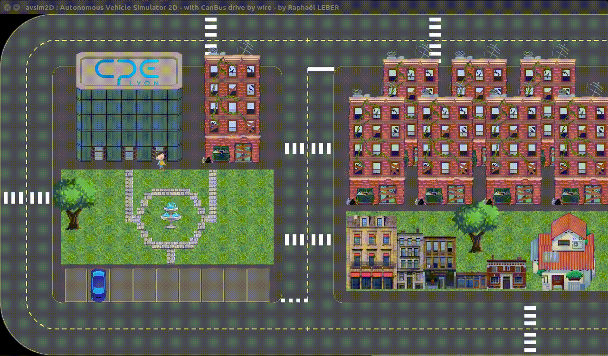

# TP 1

## Set a virtual CAN network
In a real car we have twisted-pairs of wires carring data from one CAN-controller to another. At this point of the practical work, we don't use any other material than a computer/VM. Fortunaly, we can mount virtual CAN socket on linux. Let's do so :
```bash
sudo modprobe vcan # Load virtual CAN Kernel module
sudo ip link add dev vcan0 type vcan # Add virtual CAN socket called vcan0
sudo ip link set up vcan0 # Set vcan0 up
```
Now, we can run different programs (CAN nodes) on the vcan0 bus :smiley: 


## Use common tools for CAN in linux
`can-utils` gives you a lot of helpful tools to deal with CAN frames. `can-utils` is already installed on CPE computers. If you are on a virtual machine or on your own laptop, simply install it with :
```bash
sudo apt-get install can-utils
```
### Make a test
- In one terminal, run `candump` : 
```bash
candump vcan0 # Print every frames received on vcan0
```
- In another terminal, run `cansend` : 
```bash
cansend vcan0 123#F0A1DD03 # Send 4 bytes 0xF0 0xA1 0xDD 0x03 with frame ID Ox123
```
Test a few other combinations. :pencil:  
OK. Do you get it now ?  
These 2 tools are not the only tools of can-utils. So check [the web-page of can-utils to become even more efficient](https://github.com/linux-can/can-utils)

## Let's write your own C code to send a can frame

#### Get inspired...
clone [this repository](https://github.com/craigpeacock/CAN-Examples)

Read, compile and test the 3 programs. 

#### ...now it's yours !
Write a program `test.c` sending (in a loop) 8 bytes with the ID 0x8123 on vcan0. The same program should listen and print every frames with an ID between 0x100 and 0x1FF, but not frames with other IDs. 
Test it thanks to can-utils tools.  
Your must comment each relevant line of the code with `/* comment */` :pencil:   

:raised_hand: CAN id & masks examples [here](http://www.cse.dmu.ac.uk/~eg/tele/CanbusIDandMask.html)  

:raised_hand: for 29 bits ID, check about CAN_EFF_FLAG in [this article](https://www.can-cia.org/fileadmin/resources/documents/proceedings/2012_kleine-budde.pdf) and use bit masking with | .

## Let's HACK this CAR :smiley: 

**Who is the best vehicle hacker here ?** :smiley: 
With the whole (little ^^) knowledge you just acquired, make the reverse engineering of the simulated car. The car send frames (sensors and vehicule state) and wait for frames to switch light on/off, accelerate, brake, turn, ...   

The program ["vehicle_checker"](https://gitlab.com/m0rph03nix/sadt_student/-/tree/master/bin) given to you (git repository associated to this wiki) send frames to the vehicle. If you run this program beside the simulator, you will see the vehicle acting according to the frames it receives. Check on the GIF below the way the vehicle is supposed to act with "vehicle_checker".



To do so (if those steps are not already done):
- create and set up a virtual can vcan0 (check above)
- run the simulator : `python -m avsim2D`
- and run `vehicle_checker` in another terminal  

Now, see what appends in the simulator and use can-utils (or your own program) to determinate what frame need should be sent to : 
- blink right blinkers
- blink left blinkers
- switch low beam on/off
- switch high beam on/off

Map the frames with explanations in your report :pencil: 

:pencil: [Tag](https://docs.gitlab.com/ee/university/training/topics/tags.html) your work with "TP1"

