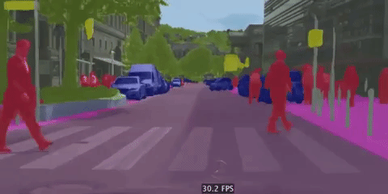
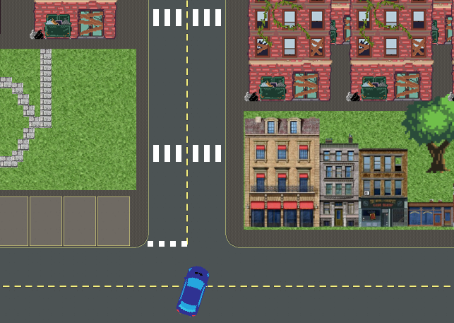
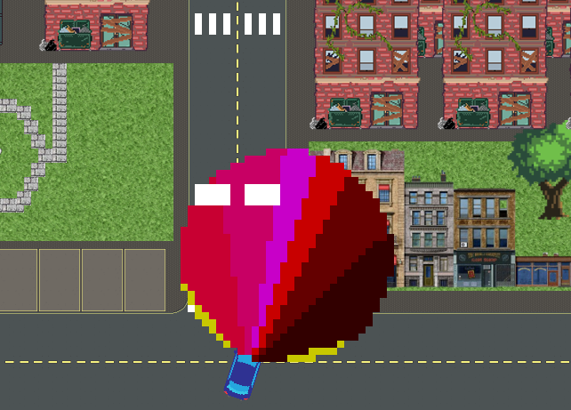

# Practical Work 2

In this practical work, you will start developing code to interact with the vehicle in the simulator. But let's doing it step by step !

So that's the plan :
- Firstly, start reading the specifications below. 
- Secondly, you will re-code `vehicle_checker` which is in an "open-loop" control. 
- Thridly, you will code a dashboard node and sementic description node
- Finally, you will start a closed-loop approch.  

:raised_hand: version >= 0.1.7 (18 april 2020) of avsim2D is required. Do this to get the last version (in your system or virtualenv depending on your settings):
```bash
pip install avsim2D --upgrade
```

## 1. Features available on CAN-Bus

### **Actuators**
- In the Powertrain / Chassis section :
  - Accelerate
  - Brake
  - Turn
  
- In the Lightings section :
  - Blink left
  - Blink right
  - Low beam
  - High Beam

### **Sensors**
- For the Dashboard (among others)
  - Speed
  - Motor Speed
  - Gear selection
- For autonomous driving
  - Front camera with semantic segmentation
 
  


### **Frame to switch on/off beams or blinkers**

Please refer to your reverse engineering of Practical Work 1


### **Frame to move the car**
:warning: Not a vehicle standard. Applies only for the simulator

ID : 0x321  
DLC : 3  
Data :  

| byte(s) | meaning  | min         | max         |
|---------|----------|-------------|-------------|
| 0       | throttle | 0% (0x00)   | 100% (0x64) |
| 1       | brake    | 0% (0x00)   | 100% (0x64) |
| 2       | steering | -100% (0x9C) | 100% (0x64) |

:raised_hand: steering is a signed char

<!--
:light_bulb: If you prefer, you can jump now to section 2, and continue the following reading later.
-->

### **Frames with vehicle speed states**
:warning: Not a vehicle standard. Applies only for the simulator

ID : 0xC06  
DLC : 2  
Data :  

| byte(s) | meaning     | min          | max                  |
|---------|-------------|--------------|----------------------|
| 0-1     | motor speed | 0 rpm (0x00) | 5998 rpm (0x6E 0x17) |


ID : 0xC07  
DLC : 2  
Data :  

| byte(s) | meaning | min | max |
| --- | --- | --- | --- |
| 0 | vehicle speed | 0 km/h (0x00) | 214 km/h% (0xD6) |
| 1 | gear selection | 0 (0x00) | 5 (0x05) |
 
 <!--
 :light_bulb: If you prefer, you can jump now to section 3, and continue the following reading later.
-->

### **Frames with semantic segmentation from the camera**

Here is an exemple of a real vehicle semantic segmentation (downloaded from Download pre-trained ICNet and PSPNet50 models [here](https://github.com/oandrienko/fast-semantic-segmentation/blob/master/docs/model_zoo.md)). The semantic segmentation is represented by différent colors. 


As we use a 2D simulator we will have a 1D set of semantic information of the environnement. The semantic is splited in 5 classes (actually 8, but 3 more classes are currently in developpement, so please don't consider them) :
- road 
- stop
- yield
- crossing
- car_park 

Can you identify some of these classe on this image ?    



So here is the area the car can see with its camera :  


  
As you can see, the area covered by the camera is splited in different colored area. These colored area represent the 6 sections described in the table below (the yellow section is not considered). The sementic weight of each area will be sent in a CAN frame. 

| CAN ID | color | area |
|-----|--------------------|-----------|
|0xC00| |full_left |
|0xC01| |left       |
|0xC02| |middle_left |
|0xC03| |middle_right| 
|0xC04| |right      |
|0xC05| |full_right|

In each area you can measure the semantic weight of each class (e.g. A lot of "road", a little bit of "yield", ...)  

For each area/frame, here is the how the semantic classes are put in the frame data

| byte(s) | meaning     | min | max |
| ---     | ---         | --- | --- |
| 0       | road        | 0   | 100|
| 1       | stop        | 0   | 100|
| 2       | yield       | 0   | 100|
| 3       | crossing    | 0   | 100|
| 4       | car_park    | 0   | 100|
| 5       | reserved... | 0   | 100|
| 6       | reserved... | 0   | 100|
| 7       | reserved... | 0   | 100|

The value of each class will increase with :
- the proximity between the vehicule and the class observed
- the size of the class observed

In other word, in the camera point of view, the more the class is big, the more the weight of this class is set heigh.

Here is an exemple of data (logged with candump) matching with the vehicle situation in the 2 pictures above :

```bash
  vcan0  00000C00   [8]  44 00 05 09 00 00 00 00
  vcan0  00000C01   [8]  2B 00 00 09 00 00 00 0B
  vcan0  00000C02   [8]  33 00 00 06 00 00 00 0C
  vcan0  00000C03   [8]  0F 00 00 00 00 00 00 06
  vcan0  00000C04   [8]  06 00 00 00 00 00 00 00
  vcan0  00000C05   [8]  2D 00 00 00 00 00 00 00

```

For each area, describe what is seen by the vehicle :pencil:.   
Here is an exemple for the 1st frame :

```
In the full left area (ID 0xC00), the vehicle sees :
- the road : 0x44
- yield marking : 0x05
- road crossing : 0x09
```


## 2. Re-code vehicle_checker

Re-code "roughly" the behavior of vehicule_checher.
Call the file `vehicule_checker_student.c` and the binary `vehicule_checker_student`

This node should wait at least once IDs 0xC00 to 0xC07 before sending.  
:pencil: 


## 3. Code a dashbord
Create a file `dashboard.c`. Write a code in order to continuously print something like this exemple: 
```bash
Speed: 27 km/h
Gear: 2
Motor speed: 2700 rpm
Action to follow the road: ->
```

`Action to follow the road` can be followed by `<-`, `^` or `->` representing moving left/straigth/right
 
 In order to test your code, you can also run `vehicle_checker`  
:pencil:  

:raised_hand: The motor speed "behavior" is a bit strange... don't care about it!


## 4. Start a closed loop approach

Create a file `road_follower.c`

Try to follow the road, roughly, even though its oscillating, and whatever the way taken at the crossroad. However, try not to exeed (too much) 50 km/h. Anyway, faster you drive, faster you fail!
:pencil: 


:pencil: [Tag](https://docs.gitlab.com/ee/university/training/topics/tags.html) your work with "TP2a"